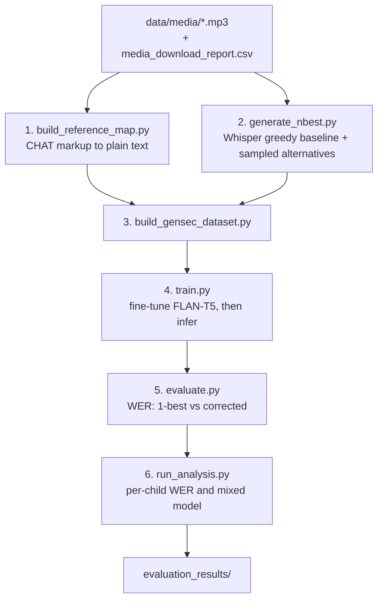

# gensec-asr: generative speech error correction

Standard ASR throws information away. Whisper ranks many candidate transcripts
internally and you keep the top one — but on child speech, which is disfluent
and off-distribution, the correct word is often sitting in a candidate that was
discarded.

This project keeps the top 5 candidates per utterance and trains a language
model (FLAN-T5) to read all of them and write the correct transcript, then
measures whether that beats the raw ASR output. That lets the corrector do
three things the acoustic model cannot: prefer the reading most hypotheses
agree on, splice the right words out of different candidates, and fall back on
what English usually sounds like.

## Running it

One command. There are no manual steps.

```bash
sbatch bash_scripts/train.sh
```

The job activates `gensec_env`, installs the pinned requirements if anything is
missing, and runs all six stages. Create the environment once first:

```bash
conda env create -f envs/gensec_env.yml
```

If the job hits the walltime, submit the same script again and it picks up
where it stopped: n-best generation resumes from the clips it has already done,
and the two expensive stages (2 and 4) skip work that exists. The cheap stages
always rerun, so a dataset that has grown since the last run is picked up
rather than cached.

After more audio arrives, resubmit the same job. Stage 4 fingerprints the
processed examples and training settings, so changed data retrains the model
and regenerates predictions even when the number of rows is unchanged.

## Layout

```text
configs/baseline.yaml     every path and hyperparameter
envs/                     conda environment and pinned requirements
bash_scripts/train.sh     the single entry point
scripts/                  the six pipeline stages
data/                     generated artifacts (gitignored)
evaluation_results/       WER and child-level analysis reports
```

## Workflow



| Stage | Script | Produces |
|---|---|---|
| 1 | `build_reference_map.py` | `data/utterance_id_to_reference.json` |
| 2 | `generate_nbest.py` | `data/utterance_id_to_nbest_greedy_sample10.json` |
| 3 | `build_gensec_dataset.py` | `data/processed_gensec.json`, `data/dropped_gensec.json` |
| 4 | `train.py` | `data/splits/*.csv`, `data/predictions/test_predictions_<mode>.csv` |
| 5 | `evaluate.py` | `evaluation_results/wer_report.txt`, `metrics.json` |
| 6 | `run_analysis.py` | `evaluation_results/analysis/per_child_wer.csv`, `anova_report.txt`, `anova_metrics.json` |

## Why there is no postprocessing stage

There was one until 2026-09-08: it collapsed repeated phrases out of the
predictions, because the first working run looped a phrase until the length
limit and emitted 110,711 insertions. `no_repeat_ngram_size` and
`repetition_penalty` now block that at generation time, and they work - no
prediction in the current run repeats a word more than three times, and none
runs past 60 words.

With the artifact gone, the only thing left for the stage to match was real
child speech. It rewrote 93 of 27,412 predictions (0.34%): 15 improved, 61 got
worse, for a net +96 word errors. Every harmful edit was the same shape -
`up up up flew the kites`, `and and and make it`, `no no no` - emphatic and
disfluent repetition that the corrector had already transcribed correctly.
Run over the ground-truth references themselves, the cleaner corrupted 271 of
them (1%). A stage that damages 1% of correct human transcripts cannot pay for
itself at a 0.34% intervention rate, so it was deleted rather than tuned.

## The data

Audio clips and reference transcripts come from the sibling
`asr-dataset-pipelines` project. This repository only reads that directory; it
does not download or cut audio. Everything reads from the clips it prepared:

```text
<media_dir>/<corpus>/<group>/<child_id>/<hash>_<start_ms>_<end_ms>_<n>.mp3
```

The clip's filename stem is the utterance id throughout. `scripts/config.py`
uses the local copy when it exists and the HPC copy otherwise, so the same code
runs in both places. The label file `media_download_report.csv` is read from the
root of whichever media directory is in use, so audio and transcripts can never
come from two different copies of the dataset. The path is resolved in
`configs/baseline.yaml`.

## Stage 1 exists because the labels need reconciling

`media_download_report.csv` is a download log, not a label file:

- most of its rows describe utterances that were never cut into a clip
- some clips on disk have no row at all, and so no transcript
- the transcripts it does carry are raw CHILDES CHAT markup, e.g.
  `well I can't put [/] put some xxx in a cup . [+ PI]`

Scoring Whisper against that markup would count annotation symbols as word
errors. Stage 1 reconciles all of it once and prints what it lost, so the
training target and the scoring reference can never drift apart.

`data/processed/all_utterances_clean.csv` upstream has cleaner text, but it has
no timestamp columns and so cannot be joined back to clip filenames. The report
CSV is the only artifact carrying the clip-to-text link.

## ASR baseline and correction candidates

Stage 2 decodes each clip once with deterministic greedy search. That transcript
is the ASR baseline and the first GenSEC input. It also draws 10 transcripts at
temperature 0.8, removes duplicates after scoring normalization, and retains up
to four sampled alternatives. Candidates sampled more often are preferred, with
distinct word choices breaking ties. The correction input has at most five
transcripts; it is never padded with duplicates. The older sampled-only n-best
file remains untouched, while the new path forces a full ASR regeneration.

The useful-diversity checks are the number of distinct candidates and the
oracle n-best WER, not the kept/dropped ratio: single-candidate utterances are
still included for training.

## Clips that get skipped

Stage 2 skips clips outside `[min_clip_seconds, max_clip_seconds]` and says how
many. Whisper only sees the first 30 seconds of audio, so a handful of
session-length files would otherwise be scored against a transcript the model
never had a chance to produce.

## Configuration

Everything tunable lives in `configs/baseline.yaml` — paths, decoding settings,
hyperparameters. Nothing is hardcoded in the scripts.

To turn on in-context learning, change one line:

```yaml
inference_modes: [zero_shot, one_shot, few_shot]
```

For a quick smoke test, cap the audio:

```yaml
asr_limit: 200
```

## Outputs

| File | Contents |
|---|---|
| `evaluation_results/wer_report.txt` | WER table for 1-best vs corrected, plus the worst utterances |
| `evaluation_results/metrics.json` | The same numbers, machine-readable |
| `evaluation_results/analysis/` | Per-child WER and group-by-model mixed-model results |
| `evaluation_results/config_used.yaml` | The settings that produced them |
| `evaluation_history/<timestamp>/` | The previous run, archived automatically |
| `data/dropped_gensec.json` | Every dropped utterance and why |

## Running one stage on its own

Normal use is the single entry point. Each script also runs standalone against
the same config, for debugging:

```bash
python scripts/build_reference_map.py
python scripts/build_gensec_dataset.py
python scripts/evaluate.py
python scripts/run_analysis.py
```

## How the test set is held out

Whole source transcripts, stratified by LT/TD. Utterances from one recording
session share a child, a recording setup and a vocabulary, so an utterance-level
split lets the corrector memorize sessions it is then scored on - which is what
this did until 2026-09-07, when all 867 test transcripts and all 821 test
children were also in the training set. Results produced before
`methodology_version: transcript_split_v2` are not comparable to results after
it, and the older numbers in `evaluation_history/` should be read as an upper
bound rather than a measurement.

Two residuals are known and reported rather than hidden:

- **12 children still span the split**, because they were recorded across
  several sessions. Split on `child_id` in `make_splits` if that has to be zero.
- **~11% of test rows are a verbatim (hypotheses, target) pair seen in
  training**, and no split can change that. They are single-word utterances -
  `yeah`, `no`, `okay`, `mhm` - that recur across hundreds of transcripts. That
  is the natural frequency of short child speech, not leakage.

## What this does not do

Left out to keep the first result interpretable:

- **No reranking or ensembling** across multiple ASR models.
- **No prompt engineering beyond the three ICL modes** already implemented.
- **No hyperparameter search.** One fine-tune at the config's settings.
- **No audio acquisition.** That is `asr-dataset-pipelines`' job; this reads a
  directory.
- **No metrics beyond WER and exact match.** No CER, BLEU, or semantic scoring.

## Plan

[PLAN.md](PLAN.md) records the design, what was borrowed from the earlier
`child-whispr-annotation` and `Ecolang/Pose` work, and the open questions.
